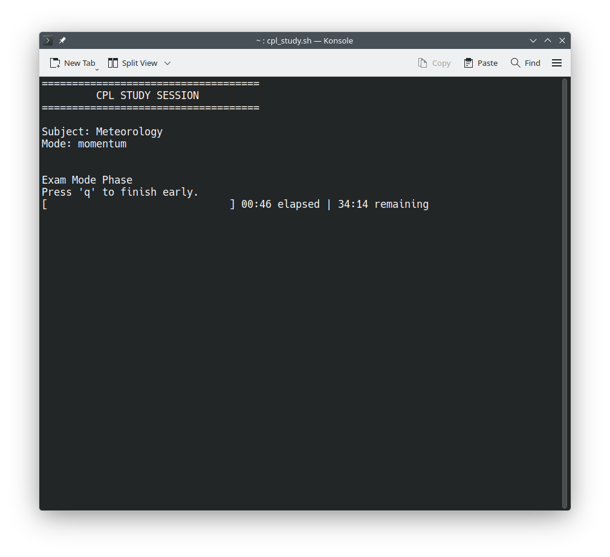
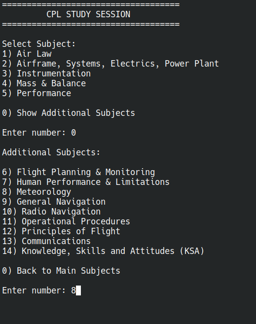
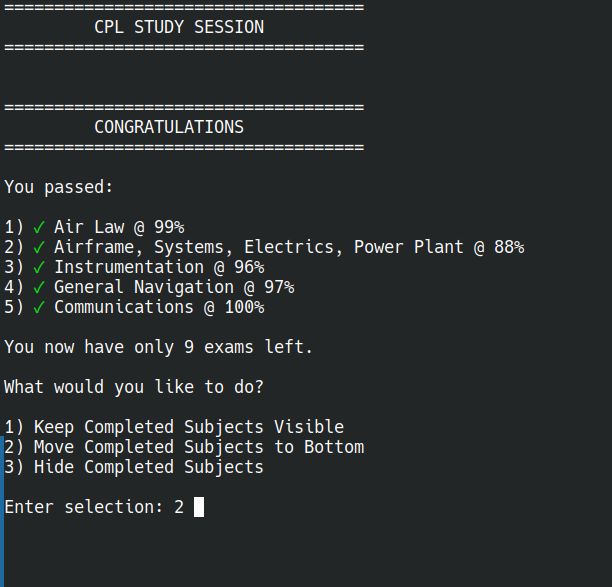
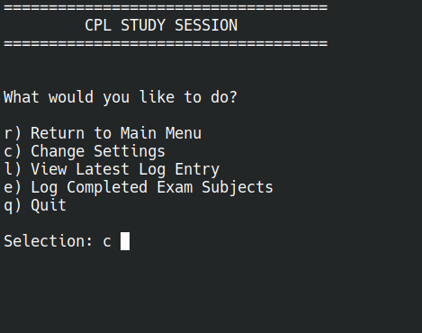
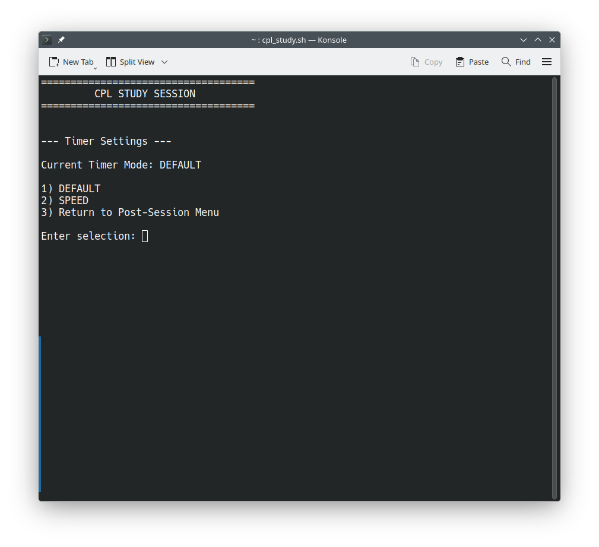

==================================================
CPL Study System
User Guide
==================================================

Created by:
c7alex359

Current Stable Release:
v15.7.6

Current Development Version:
v16.x-dev

==================================================

Purpose:
The CPL Study System supports structured
EASA CPL exam preparation through:

- timed study sessions
- exam simulation workflows
- persistent progression tracking
- structured reflection logging
- runtime-configurable study prioritization

The system is designed as a lightweight,
terminal-native operational study environment
for long-term structured learning.

Concept:

The CPL Study System is designed to work
alongside existing CPL/ATPL study materials,
question banks, and literature sources.

Examples include:

- AviationExam
- ATPLQ
- Printed manuals
- PDF study material
- Classroom instruction
- Personal notes and summaries

The system does not replace these resources.

Instead, it provides the operational
study structure around them.

In practical terms, the system answers:

"Now that I have thousands of exam questions
and hundreds of pages of study material...
what do I actually do with them?"

The CPL Study System provides:

- structured study workflows
- timed deep-work execution
- progression continuity
- reflection and review cycles
- persistent long-term study organization

==================================================

Core Workflow:

1. Select subject
   - Primary or Additional Subjects
   - Persistent progression visibility
   - Completed-subject tracking

2. Select session mode
   - Full Session
   - Foundation Session
   - Momentum Session
   - Endurance Session

3. Complete study phases
   - Warm-up
   - Target Study
   - Exam Phase (optional)
   - Review Phase

4. Record performance metrics
   - Score
   - Confidence
   - Mock pass state

5. Write structured reflection notes
   - Multi-line nano editor
   - Formatting preserved

6. Session stored automatically
   - Global TXT / CSV logs
   - Subject TXT / CSV logs
   - Persistent cumulative totals

==================================================

Progression System

Version 15.x introduces persistent
subject progression tracking.

Features:

- Completed-subject persistence
- Green checkmark rendering
- Move-to-bottom workflows
- Optional completed-subject hiding
- Runtime progression continuity

The system supports long-term progression
through the full CPL syllabus.

==================================================

Operational Workflow

The CPL Study System supports continuous
post-session operational workflows.

After each session users may:

- start another session
- modify focus subjects
- adjust timer pacing
- manage progression visibility
- review latest log entries
- maintain cumulative study continuity

This architecture allows uninterrupted
runtime continuity without restarting
the operational environment.

==================================================

Session Modes

1) Study + Exam (Full Session)

   Includes:
   - Warm-up
   - Target Study
   - Exam
   - Error Review
   - Notes Reflection

2) Study Only (Foundation Session)

   Includes:
   - Warm-up
   - Target Study
   - Review
   - Notes Reflection

3) Exam Only (Momentum Session)

   Includes:
   - Variable question exam
   - Short review phase
   - Rapid reinforcement workflow

4) Exam Only (Endurance Session)

   Includes:
   - Extended exam simulation
   - Long-form review phase
   - Endurance pacing workflow

==================================================

Timer System

Version 15.x introduces runtime-selectable
timer pacing modes.

Available Modes:

DEFAULT
- Standard CPL pacing behavior

SPEED
- Increased time-pressure environment
- Faster pacing simulation

Timer configuration persists automatically
across sessions.

==================================================

Study Continuity System

The system supports integration of
previously completed study time.

Features:

- Persistent cumulative integration
- hh:mm onboarding support
- Historical log preservation
- Runtime-adjustable continuity tracking

This allows late adoption without
losing prior study effort visibility.

==================================================

Notes Editor (nano)

The CPL Study System includes a structured
multi-line Notes editor powered by nano.

Features:

- Multi-line note support
- Preserved indentation
- Width-aware editing
- Readable chronological TXT logs
- CSV-safe logging architecture

TXT logs preserve human-readable reflections.

CSV logs preserve structured numeric
performance data only.

==================================================

Subject-Specific Logging

Each subject maintains independent:

- TXT study history
- CSV performance tracking
- Session numbering
- Cumulative totals

This allows focused long-term review
without unrelated study noise.

==================================================

Runtime Configuration Architecture

Version 15.x introduces a fully
configuration-driven runtime architecture.

Core Configuration Files:

subjects.db
- Canonical subject registry

active_subjects.conf
- Runtime subject ordering

primary_subject_count.conf
- Startup menu partitioning

completed_subjects.conf
- Progression-state persistence

hidden_subjects.conf
- Visibility-state persistence

timer_mode.conf
- Runtime pacing configuration

previous_study_minutes.conf
- Study continuity integration

==================================================

Quality Assurance

- Runtime-tested under Linux
- Clean-user installation validated
- ShellCheck-reviewed Bash architecture
- Persistent logging integrity verified
- Runtime configuration system validated
- Multi-session progression workflows tested
- Distribution deployment verified

Development and release validation includes:

- ShellCheck static analysis
- Clean-install deployment testing
- Runtime workflow validation
- Live study-session verification

==================================================

Quick Start

1. Extract package:

tar -xzf CPL_Study_System_v15.7.6.tar.gz

2. Enter directory:

cd CPL_Study_System_v15.7.6

3. Run installer:

./install_cpl.sh

4. Reload shell configuration.

Linux:

source ~/.bashrc

(or source ~/.alias if your system uses ~/.alias)

macOS:

source ~/.zshrc

5. Start system:

cpl-study

View study logs anytime with:

cpl-log

==================================================

System Status

Stable Release:
v15.7.6

Status:

Operationally stable and runtime validated
through live multi-session execution.

Version 15.7.6 represents the mature
pre-modularization generation of the
CPL Study System.

Current Development Branch:
v16.x-dev

==================================================

License

Licensed under GNU GPL v3.0.

See LICENSE for details.

==================================================
